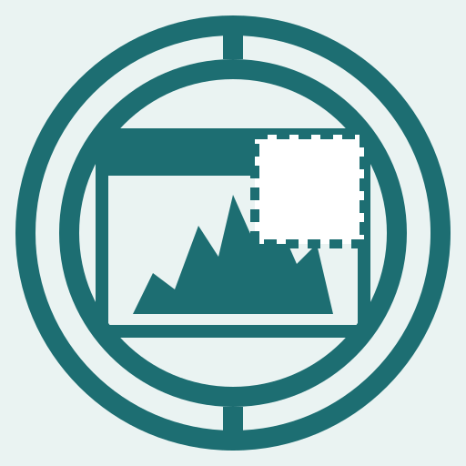

# Outcrop

 <br>

Clip a region of a webpage into an Obsidian vault. Drag a rectangle in Firefox; a markdown note — with the source URL, your annotations, and the cropped PNG — lands in an Obsidian vault on disk.

Two halves, both running on the user's machine. No cloud, no account.

- **Firefox extension** (`extension/firefox/`) — selection overlay, screen capture, preview-with-notes UI.
- **Local Go server** (`cmd/outcrop/`) — receives the clip over loopback, writes the note and image into the right vault, tracks per-domain history so future captures default to the most-recently-used vault for the page.

```
┌─────────────────────┐   GET /vaults?url=&title=   ┌──────────────────────┐
│ Firefox extension   │ ──────────────────────────▶ │ outcrop serve        │ ─▶ Obsidian vault(s)
│ - drag overlay      │   POST /clip                │ - 127.0.0.1:7878     │   (filesystem)
│ - preview + notes   │ ──────────────────────────▶ │ - SQLite-backed      │
└─────────────────────┘                             └──────────────────────┘
```

The full design is in [`docs/rfd/`](docs/rfd/). The README in that directory explains the RFD format and lifecycle.

## Status

| Half | Status | RFD |
|---|---|---|
| Architecture overview | `discussion` | [0001](docs/rfd/0001-architecture-overview.md) |
| V1 server | `committed` | [0003](docs/rfd/0003-v1-server.md) |
| Firefox extension | `draft` | [0004](docs/rfd/0004-firefox-extension.md) |
| Click-element capture (post-v1) | `ideation` | [0002](docs/rfd/0002-click-element-capture.md) |

## Server

Prerequisites: Go (see `go.mod` for the directive).

```sh
go build ./cmd/outcrop
./outcrop init                                # writes config DB, prints a token

# Register an Obsidian vault. A description is strongly recommended if you
# plan to use the LLM router (RFD 0005) — vaults without one are at a
# routing disadvantage versus vaults that have one.
./outcrop vault add \
    --description "life admin, journaling, news, things to remember" \
    Personal /path/to/Vault

./outcrop serve                               # listens on 127.0.0.1:7878
```

Save the token printed by `init` — you'll paste it into the extension on first run.

The wire contract is small enough to drive by hand:

```sh
TOKEN=...   # from `outcrop init`
VAULT=...   # from `outcrop vault list`
IMG=$(base64 -i some.png)

curl -sS -H "Authorization: Bearer $TOKEN" \
        -H "Content-Type: application/json" \
        -d "{\"vault\":\"$VAULT\",\"url\":\"https://example.com\",\"title\":\"Example\",\"selectedText\":\"\",\"notes\":\"\",\"imageBase64\":\"$IMG\"}" \
        http://127.0.0.1:7878/clip
```

Other CLI subcommands:

```
outcrop vault list
outcrop vault rename <key> <newName>
outcrop vault remove <key>
outcrop vault default <key>
outcrop config show [--show-token]
outcrop config path
```

Tests: `go test ./...`.

## Firefox extension

Prerequisites: Node ≥ 20.

```sh
cd extension/firefox
npm install
npm run build          # → dist/
```

Load the extension via Firefox's `about:debugging#/runtime/this-firefox` → **Load Temporary Add-on…** → pick `extension/firefox/dist/manifest.json`. The options page opens automatically on first install — paste the token from `outcrop init`, click **Test connection**.

Capture flow: click the toolbar icon → pick a vault → **Capture** → drag a rectangle → type notes → **⌘/Ctrl+Enter** to save (or **Escape** to cancel).

`npm run package` produces a loadable `.xpi` in `dist-artifacts/`. See [`extension/firefox/README.md`](extension/firefox/README.md) for development details (`npm run dev`, etc.).

## Project layout

```
.
├── cmd/outcrop/        # CLI entrypoint
├── cli/                # init / serve / vault / config subcommand implementations
├── server/             # HTTP handlers, middleware, CORS, auth
├── store/              # SQLite schema, migrations, vault / history / meta accessors
├── vault/              # vault path resolution, atomic + exclusive writes
├── clip/               # write-a-clip orchestration (decode PNG + compose markdown)
├── extension/firefox/  # Firefox MV3 extension (TypeScript + esbuild + web-ext)
├── docs/rfd/           # design RFDs
├── vendor/             # vendored Go dependencies
└── go.mod
```

The Go packages live at the root rather than under `internal/` — outcrop isn't published as a library, so the import-prevention `internal/` provides isn't earning its keep here.
